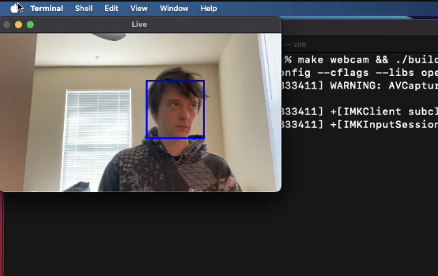

# Viola-Jones Face Detection

## Description
I translated the method proposed by Viola and Jones¹ to detect faces over an image into a C++ implementation. A multi-threaded program trains the learner and serializes its parameters into JSON. A second program reconstructs the serialized model and superimposes rectangles over a webcam to indicate positions of faces in real time. The model is trained over a set of 5000 natural images provided by Roy et al.² and 5000 faces courtesy of Li³. The only dependency is OpenCV to read images and display a video feed from the webcam. 

## Key features 
* C++ Viola-Jones implementation with AdaBoost
* Integral image generator
* Haar-like wavelet features easily configurable with OOP (600,000+ by default)
* Serializable learner that trains in time linear to input images
* Custom thread pool that enabled training over 10,000 250px by 250px images in 24 hours on a M4 MacBook Pro
* Real time visualization of face prediction via webcam with frame skipping and AdaBoost cascade heuristics

## Dependencies
* `pkg-config`
* OpenCV for C++
* GNU C++ compiler with C++17 support
* CMake

## Program use
* Webcam view: build and run the live webcam view with `make webcam && ./build/webcam.out`
* Training: build and run the learner trainer with `make && ./build/train.out`; the trainer expects 250px by 250px JPEG images to be stored in `rsrc/face_edited` and `rsrc/non_face_edited`
* **Note**: both programs have only been tested on macOS Sequoia 15.0

## Citations
1. Viola, Paul, and Michael Jones. "Rapid object detection using a boosted cascade of simple features." Proceedings of the 2001 IEEE computer society conference on computer vision and pattern recognition. CVPR 2001. Vol. 1. Ieee, 2001.
2. [https://www.kaggle.com/datasets/prasunroy/natural-images](https://www.kaggle.com/datasets/prasunroy/natural-images)
3. [https://www.kaggle.com/datasets/jessicali9530/lfw-dataset](https://www.kaggle.com/datasets/jessicali9530/lfw-dataset)
